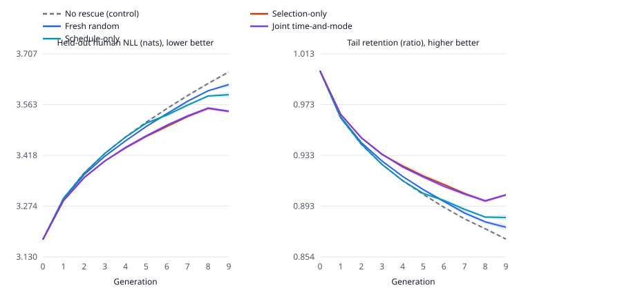

# Table preview -- primary_pilot_v2_2026-08-19

**AUTO-GENERATED by `scripts/generate_final_tables.py`. Do not edit values.**
Source: `results/runs/primary_pilot_v2_2026-08-20`. Layout: `docs/paper/final_tables_plan.md`.

> Generated from 25 chains under run `primary_pilot_v2_2026-08-19`. Whether these numbers may be quoted anywhere else is
> governed by `PROTOCOL.md` §5, not by this file.

## Table 1 — Budget realisation

| Policy | Chains | Human tokens | % of ceiling | Total tokens | Within bound |
|---|---:|---:|---:|---:|:--:|
| No rescue (control) | 5 | 0 | 0.00 | 16,678,912 | yes |
| Fresh random | 5 | 749,869 | 99.98 | 16,678,912 | yes |
| Schedule-only | 5 | 749,878 | 99.98 | 16,678,912 | yes |
| Selection-only | 5 | 749,827 | 99.98 | 16,678,912 | yes |
| Joint time-and-mode | 5 | 749,827 | 99.98 | 16,678,912 | yes |

*Caption (draft).* Realised spend per policy against a 750,000 optimizer-token lifetime ceiling, in tokens actually consumed by the optimizer. A policy is within bound when its shortfall is no larger than the largest single rescue candidate (26,902 tokens), which is the only shortfall indivisibility can explain. Fair comparison additionally requires the realised spread across arms to stay below 0.20% on both axes.

## Table 2 — Per-arm outcomes

| Policy | Chains | AUC regret ↓ | SD | CV (%) | Tail retention ↑ | SD |
|---|---:|---:|---:|---:|---:|---:|
| No rescue (control) | 5 | 2.6431 | 0.0140 | 0.53 | 0.8676 | 0.0007 |
| Fresh random | 5 | 2.5364 | 0.0080 | 0.32 | 0.8769 | 0.0023 |
| Schedule-only | 5 | 2.5261 | 0.0194 | 0.77 | 0.8846 | 0.0024 |
| Selection-only | 5 | **2.2931** | 0.0250 | 1.09 | **0.9024** | 0.0007 |
| Joint time-and-mode | 5 | 2.3034 | 0.0221 | 0.96 | **0.9024** | 0.0010 |

*Caption (draft).* Area under the generation-wise held-out human NLL-regret curve (nats x generations, lower is better) and end-of-horizon tail retention (ratio in [0,1], higher is better), each averaged over the frozen seed set with between-chain SD. Bold marks the best value among arms whose realised spend is within the permitted 0.20% spread of one another. Every spending arm qualifies in this run, so the ranking is over all of them; the control spends nothing by construction and is not ranked.

## Table 3 — Paired contrasts

| Contrast | ΔAUC ↓ | 95% CI | Relative (%) | Δhuman (%) | Δtotal (%) | Verdict |
|---|---:|---:|---:|---:|---:|---|
| **Joint time-and-mode − selection-only (primary)** | +0.0103 | [-0.0092, +0.0297] | +0.45 | 0.00 | 0.00 | **negligible** |
| Joint time-and-mode − schedule-only | -0.2227 | [-0.258, -0.187] | -8.82 | -0.01 | 0.00 | beneficial |
| Schedule-only − fresh random | -0.0103 | [-0.036, 0.016] | -0.41 | 0.00 | 0.00 | negligible |
| Selection-only − fresh random | -0.2433 | [-0.269, -0.218] | -9.59 | -0.01 | 0.00 | beneficial |
| Fresh random − no rescue (control) | -0.1067 | [-0.121, -0.092] | -4.04 | — | 0.00 | beneficial |

*Caption (draft).* Paired-by-seed differences in NLL-regret AUC, with two-sided 95% intervals over the frozen seeds. A contrast whose arms differ by more than 0.20% on either budget axis is reported as not established rather than as a number: unequal data, not allocation strategy, would explain any difference. Verdicts are the four preregistered labels, read against a practical-equivalence region of ±0.0507 AUC units. Primary baseline: lower mean AUC regret of the two eligible arms, read from primary outcomes because this run carries no validation-only screening chains.

## Figure 1 — Trajectories

*Caption (draft).* Held-out human NLL (nats, lower is better) and tail retention (ratio, higher is better) against generation, mean over the frozen seed set with a ±1 SD band. The no-rescue control is dashed: it spends nothing by construction and is the reference point rather than a competitor.

## Appendix tables

`T4_trajectory.tex` (per-generation means) and `T5_per_chain.tex` (one row per chain, 25 rows) are generated alongside these and are meant for the appendix.

