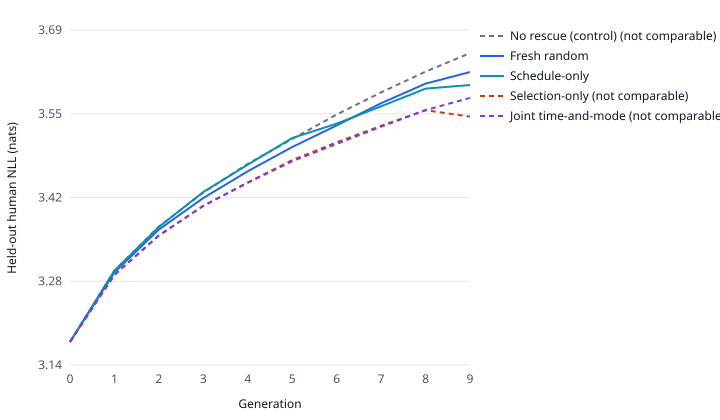

# Table preview -- primary_pilot_2026-08-18

**AUTO-GENERATED by `scripts/generate_final_tables.py`. Do not edit values.**
Source: `results/runs/primary_pilot_2026-08-18`. Layout: `docs/paper/final_tables_plan.md`.

> These are **pilot** numbers, shown to exercise the layout the final grid will
> use. The pilot's primary contrast is not established (FAILURE_LOG.md F-020,
> F-021). Nothing here is a result.

## Table 1 — Budget realisation

| Policy | Chains | Human tokens | % of ceiling | Total tokens | Within bound |
|---|---:|---:|---:|---:|:--:|
| No rescue (control) | 5 | 0 | 0.00 | 16,678,912 | yes |
| Fresh random | 5 | 749,869 | 99.98 | 16,777,421 | yes |
| Schedule-only | 5 | 749,878 | 99.98 | 16,773,427 | yes |
| Selection-only | 5 | 749,827 | 99.98 | 17,063,936 | yes |
| Joint time-and-mode | 5 | 674,193 | 89.89 | 17,025,024 | **no** |

*Caption (draft).* Realised spend per policy against a 750,000 optimizer-token lifetime ceiling, in tokens actually consumed by the optimizer. A policy is within bound when its shortfall is no larger than the largest single rescue candidate (26,902 tokens), which is the only shortfall indivisibility can explain. Fair comparison additionally requires the realised spread across arms to stay below 0.20% on both axes.

## Table 2 — Per-arm outcomes

| Policy | Chains | AUC regret ↓ | SD | CV (%) | Tail retention ↑ | SD |
|---|---:|---:|---:|---:|---:|---:|
| No rescue (control) | 5 | 2.6374 | 0.0176 | 0.67 | 0.8686 | 0.0021 |
| Fresh random | 5 | **2.5245** | 0.0206 | 0.81 | 0.8765 | 0.0015 |
| Schedule-only | 5 | 2.5458 | 0.0276 | 1.08 | **0.8829** | 0.0017 |
| Selection-only | 5 | 2.3132 | 0.0113 | 0.49 | 0.9015 | 0.0021 |
| Joint time-and-mode | 5 | 2.3216 | 0.0095 | 0.41 | 0.8916 | 0.0015 |

*Caption (draft).* Area under the generation-wise held-out human NLL-regret curve (nats x generations, lower is better) and end-of-horizon tail retention (ratio in [0,1], higher is better), each averaged over the frozen seed set with between-chain SD. Bold marks the best value **among arms whose realised spend is within the permitted 0.20% spread of one another** (Fresh random, Schedule-only); the remaining arms received different amounts of data and are shown but not ranked.

## Table 3 — Paired contrasts

| Contrast | ΔAUC ↓ | 95% CI | Relative (%) | Δhuman (%) | Δtotal (%) | Verdict |
|---|---:|---:|---:|---:|---:|---|
| **Joint − selected baseline** | — | — | — | — | — | baseline not selected |
| Joint time-and-mode − schedule-only | — | — | — | -10.09 | 1.50 | not established |
| Joint time-and-mode − selection-only | — | — | — | -10.09 | -0.23 | not established |
| Schedule-only − fresh random | 0.0213 | [-0.016, 0.058] | 0.84 | 0.00 | -0.02 | negligible |
| Selection-only − fresh random | — | — | — | -0.01 | 1.71 | not established |
| Fresh random − no rescue (control) | — | — | — | — | 0.59 | not established |

*Caption (draft).* Paired-by-seed differences in NLL-regret AUC, with two-sided 95% intervals over the frozen seeds. A contrast whose arms differ by more than 0.20% on either budget axis is reported as not established rather than as a number: unequal data, not allocation strategy, would explain any difference. The primary row stays empty because the preregistered baseline is chosen from validation-only screening chains, which this run does not carry.

## Figure 1 — Held-out NLL by generation

*Caption (draft).* Held-out human NLL (nats, lower is better) against generation, averaged over the frozen seed set. Dashed lines mark arms whose realised spend places them outside the comparable set, so their separation from the solid lines cannot be read as an effect of allocation.

## Appendix tables

`T4_trajectory.tex` (per-generation means) and `T5_per_chain.tex` (one row per chain, 25 rows) are generated alongside these and are meant for the appendix.

